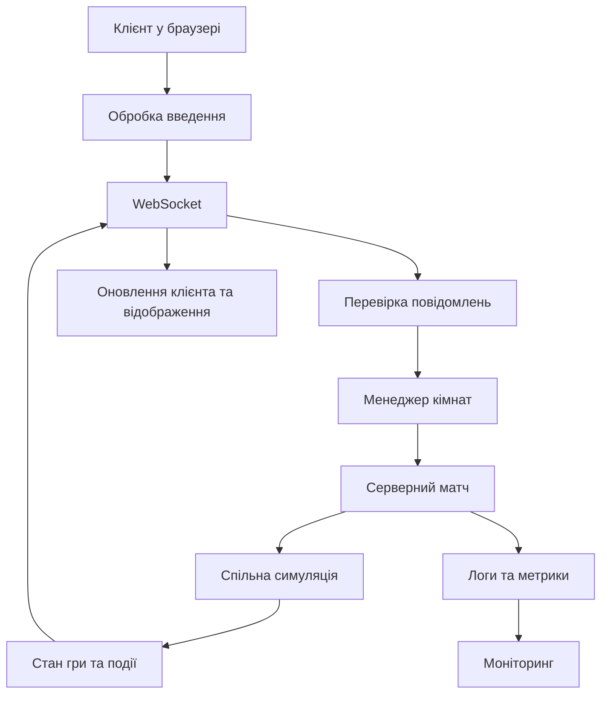

# Dogfight — багатокористувацька гра в космічному бою

**Dogfight** — браузерна багатокористувацька гра в реальному часі, розроблена на TypeScript. Гравці керують космічними кораблями, переміщуються ареною, стріляють і взаємодіють з іншими учасниками матчу.

Проєкт зосереджений не лише на ігровій механіці, а й на мережевій взаємодії, серверній симуляції, двійковому протоколі, тестуванні, моніторингу та розгортанні.

**Посилання на гру:** https://lab0-8.onrender.com

Гру можна завантажити на телефон:


Гра двох гравців на ПК:


## Основні можливості

* Багатокористувацька гра з обміном даними в реальному часі через WebSocket.
* Серверна авторитетна симуляція ігрового світу.
* Спільна симуляція для клієнта та сервера.
* Двійкове кодування повідомлень за допомогою `ArrayBuffer` і `DataView`.
* Ігрові кімнати, лобі та список гравців.
* Космічні кораблі, астероїди, снаряди, зіткнення, вибухи та бонуси.
* Відображення мережевих показників і можливість досліджувати затримки.
* Автоматизовані тести, зокрема property-based тести.
* Контейнеризація та підготовка до production-розгортання.

## Архітектура проєкту

Проєкт використовує архітектуру клієнт–сервер. Клієнт відповідає за інтерфейс, введення користувача та відображення гри. Сервер обробляє повідомлення, керує кімнатами й контролює стан матчу.



### Структура проєкту

| Каталог            | Призначення                                                                          |
| ------------------ | ------------------------------------------------------------------------------------ |
| `client/`          | Клієнтська частина, інтерфейс, рендеринг, введення та мережевий код                  |
| `server/`          | WebSocket-сервер, кімнати, матчі, перевірка повідомлень і серверна логіка            |
| `shared/`          | Спільна симуляція, типи повідомлень і протоколи                                      |
| `shared/sim/`      | Ігровий світ, кораблі, астероїди, снаряди, зіткнення та генерація випадкових значень |
| `shared/protocol/` | Типи повідомлень і правила протоколу                                                 |
| `shared/codec/`    | Кодування та декодування JSON- і двійкових повідомлень                               |

### Серверна симуляція

Сервер є авторитетним джерелом стану гри. Клієнт надсилає введення гравця, а сервер обробляє його та оновлює симуляцію.

Цільова частота симуляції — **30 тактів за секунду**. Серверна модель дає змогу централізовано перевіряти дії гравців і зменшувати залежність від стану, який повідомляє клієнт.

### Мережевий протокол

Для обміну повідомленнями використовується WebSocket. Проєкт містить JSON- і двійковий кодеки.

Двійковий кодек працює з буферами даних і `DataView`, що дозволяє явно контролювати представлення даних на рівні байтів.

Коректність кодування та декодування перевіряється автоматизованими тестами.

## Технології

* TypeScript і JavaScript
* Node.js
* WebSocket (`ws`)
* HTML Canvas
* Vite
* Vitest
* Property-based тестування
* Docker і Docker Compose
* GitHub Actions
* Render

## Запуск проєкту локально

### Необхідні інструменти

* Node.js сумісної з проєктом версії
* npm
* Git

Для контейнерного запуску також потрібен Docker.

### Встановлення

Клонуйте репозиторій і встановіть залежності:

```bash
git clone https://github.com/LizaRev/Lab0_8.git
cd Lab0_8
npm install
```

### Запуск у режимі розробки

```bash
npm run dev
```

Якщо кореневий скрипт не запускає одночасно клієнт і сервер, використайте скрипти, визначені у відповідних `package.json`.

### Збірка

```bash
npm run build
```

### Перевірка типів

```bash
npm run typecheck
```

### Тестування

```bash
npm test
```

Наявність і точні назви скриптів необхідно звірити з актуальним `package.json`. Результати виконання слід перевірити перед фінальним релізом.

## M1 — Підготовка production-процесу

Мета цього етапу — забезпечити контрольований запуск і завершення сервера, перевірку його стану, структуроване логування, метрики та валідацію конфігурації.

### Коректне завершення роботи

Після отримання сигналу `SIGTERM` сервер повинен:

1. Припинити приймання нових підключень.
2. Надіслати підключеним клієнтам повідомлення про завершення роботи.
3. Закрити WebSocket-з'єднання з кодом `1001`.
4. Скинути буферизовані логи та необхідні дані.
5. Завершити роботу з кодом `0` менш ніж за 10 секунд.

Цей сценарій потрібно перевірити на запущеному сервері та зафіксувати фактичний час завершення.

### Перевірка стану сервера

Передбачені два призначені для моніторингу маршрути:

* `GET /health` — перевірка працездатності процесу та інформація про версію збірки.
* `GET /ready` — перевірка готовності сервера приймати трафік.

Версія збірки повинна містити Git SHA та відображатися також в ігровому HUD.

### Структуроване логування

Для логування використовується `pino`.

Записи повинні містити контекстні поля, зокрема `roomId` і `playerId`, а також тип події, причину відхилення повідомлення та інформацію про помилки.

Рівень логування налаштовується через змінну середовища `LOG_LEVEL`. Непередбачені помилки повинні реєструватися разом зі стеком викликів.

### Метрики

Через `/metrics` або сторінку статистики необхідно надавати такі показники:

* Кількість підключених гравців.
* Кількість активних кімнат.
* Кількість повідомлень за секунду.
* Кількість переданих байтів за секунду.
* 99-й перцентиль часу виконання такту симуляції.
* Використання циклу подій.
* Обсяг резидентної пам'яті процесу (RSS).
* Кількість відхилень за причинами.

Метрики потрібні для виявлення перевантаження, надмірної кількості некоректних повідомлень і впливу навантаження на симуляцію.

## M2 — Захист і стійкість до помилок

### Перевірка джерела підключення

Під час WebSocket handshake сервер повинен перевіряти заголовок `Origin` відповідно до налаштування `ALLOWED_ORIGINS`.

Підключення з недозволених джерел потрібно відхиляти.

### Обмеження ресурсів

Сервер повинен контролювати:

* Кількість підключень з однієї IP-адреси.
* Максимальний розмір повідомлення.
* Частоту надсилання повідомлень.
* Час очікування приєднання до кімнати.
* Обсяг буферизованих даних для повільних клієнтів.

Відхилені повідомлення та підключення повинні логуватися й враховуватися в метриках.

### Конфігурація

Основні параметри конфігурації:

| Змінна                   | Призначення                                         |
| ------------------------ | --------------------------------------------------- |
| `ALLOWED_ORIGINS`        | Дозволені джерела WebSocket-підключень              |
| `MAX_CONNECTIONS_PER_IP` | Максимальна кількість підключень з однієї IP-адреси |
| `MAX_ROOMS`              | Максимальна кількість кімнат                        |
| `MAX_PLAYERS_PER_ROOM`   | Максимальна кількість гравців у кімнаті             |
| `LOG_LEVEL`              | Рівень логування                                    |

Конфігурацію потрібно перевіряти за допомогою Zod під час запуску. Некоректні значення мають спричиняти зрозумілу помилку.

### Навантажувальне тестування

Для перевірки під навантаженням використовується скрипт навантажувального тестування з попередньої лабораторної. Тест потрібно виконувати проти staging-контейнера, а не лише локально.

У звіті необхідно зафіксувати:

* Кількість одночасних клієнтів.
* Тривалість тесту.
* Повідомлення та байти за секунду.
* Час такту p99.
* Використання пам'яті.
* Використання циклу подій.
* Кількість відхилених повідомлень.

**Результати тестування:** будуть додані після виконання тесту на staging-середовищі.

### Тестування відмов

Необхідно перевірити три сценарії:

1. Відключення клієнта під час матчу.
2. Примусове завершення сервера під час матчу.
3. Надсилання некоректних кадрів із частотою 1000 повідомлень за секунду.

Очікувана поведінка: некоректні повідомлення відхиляються, з'єднання за потреби закриваються, причини відмов реєструються в логах і метриках, а інші кімнати продовжують працювати без суттєвого погіршення часу такту.

Після перезапуску сервера клієнт повинен повторно підключатися з поступовим збільшенням затримки між спробами та показувати гравцеві зрозуміле повідомлення про повернення до лобі.

Результати потрібно підтвердити логами та метриками, включно з часом такту інших кімнат.

## M3 — Контейнеризація та CI/CD

### Docker

Production-образ повинен створюватися за допомогою багатостадійного `Dockerfile`. Фінальний контейнер має працювати від непривілейованого користувача, використовувати exec-форму `CMD` та містити `HEALTHCHECK`.

Файл `.dockerignore` повинен виключати непотрібні файли розробки, локальні залежності, результати тестів і звіти покриття.

Для локального запуску в середовищі, наближеному до production, використовується Docker Compose:

```bash
docker compose up --build
```

### Розмір образу

Ціль — production-образ розміром менше ніж **200 МБ**.

| Показник               | Значення          |
| ---------------------- | ----------------- |
| Цільовий розмір образу | Менше 200 МБ      |
| Фактичний розмір       | Потрібно виміряти |

Фактичний розмір необхідно записати після створення production-образу.

### Автоматизація збірки та розгортання

GitHub Actions повинен виконувати перевірки під час кожного push. Для тегів, що відповідають шаблону `v*`, pipeline має:

1. Зібрати production-образ.
2. Опублікувати образ у GitHub Container Registry (GHCR).
3. Розгорнути відповідну версію на платформі хостингу.

Після розгортання потрібно перевірити роботу HTTPS і захищених WebSocket-з'єднань (`WSS`), а також heartbeat через проксі хостингу.

Версія в `/health` має відповідати фактично розгорнутому коміту або тегу.

### Розгортання

**Публічна версія гри:** https://lab0-8.onrender.com

Під час фінальної перевірки необхідно підтвердити доступність сервера, роботу WebSocket через публічну адресу та відповідність версії збірки.

## M4 — Запуск і завершення проєкту

### Перевірка гри двома гравцями

Фінальне тестування передбачає одночасну гру двох людей, які використовують різні мережі.

Потрібно перевірити:

* Приєднання обох гравців до однієї кімнати.
* Синхронізацію руху та бойових дій.
* Стабільність WebSocket-з'єднань.
* Роботу мережевого графіка.
* Стан сервера під час гри.

Результат потрібно записати у вигляді GIF або відео та додати до README.

**Відеозапис демонстрації:** буде додано після запису.

### Вимірювання мережевої затримки

У таблицю необхідно внести фактичні результати двох учасників. Симульована затримка не замінює вимірювання реального RTT.

| Учасник   | RTT               | Втрати пакетів або оновлень | Примітки       |
| --------- | ----------------- | --------------------------- | -------------- |
| Гравець A | Потрібно виміряти | Потрібно виміряти           | Реальна мережа |
| Гравець B | Потрібно виміряти | Потрібно виміряти           | Інша мережа    |

Імена учасників у звіті потрібно анонімізувати.

### Моніторинг доступності

Необхідно налаштувати зовнішній моніторинг маршруту `/health` та записати період спостереження й результати перевірок.

### PWA

Потрібно додати маніфест Progressive Web App і перевірити встановлення гри на телефоні. У звіті слід зазначити пристрій, браузер і результат перевірки.

### Фінальний реліз

Фінальна версія повинна мати тег `v1.0.0`.

Перед створенням і відправленням тегу потрібно переконатися, що `origin` вказує саме на репозиторій `LizaRev/Lab0_8`, а релізний коміт перевірений.

## Вимірювання продуктивності

У цьому розділі зібрані результати порівняння протоколів, роботи збирача сміття та пропускної здатності сервера.

### JSON і двійковий протокол

| Показник            | JSON              | Binary            |
| ------------------- | ----------------- | ----------------- |
| Розмір повідомлення | Потрібно виміряти | Потрібно виміряти |
| Час кодування       | Потрібно виміряти | Потрібно виміряти |
| Час декодування     | Потрібно виміряти | Потрібно виміряти |
| Пропускна здатність | Потрібно виміряти | Потрібно виміряти |

Порівняння слід виконувати на однакових повідомленнях і за однакових умов.

### Вплив збирача сміття (GC)

| Показник                | До оптимізації    | Після оптимізації |
| ----------------------- | ----------------- | ----------------- |
| Використання heap       | Потрібно виміряти | Потрібно виміряти |
| Активність або паузи GC | Потрібно виміряти | Потрібно виміряти |
| Час такту p99           | Потрібно виміряти | Потрібно виміряти |

Потрібно описати, яку саме зміну перевіряли, і не приписувати їй покращення без фактичних вимірювань.

### Пропускна здатність сервера

| Одночасні клієнти |     Повідомлень/с |          Tick p99 |               RSS |        Відхилення |
| ----------------: | ----------------: | ----------------: | ----------------: | ----------------: |
| Потрібно виміряти | Потрібно виміряти | Потрібно виміряти | Потрібно виміряти | Потрібно виміряти |

Тести необхідно виконувати повторювано з однаковою конфігурацією.

## Безпека та надійність

У проєкті передбачено або необхідно перевірити такі механізми захисту:

* Перевірка вхідних повідомлень на сервері.
* Перевірка `Origin` для WebSocket.
* Обмеження розміру повідомлень і частоти запитів.
* Ліміти підключень і кількості гравців у кімнатах.
* Тайм-аут приєднання.
* Обробка повільних клієнтів.
* Структуроване логування помилок.
* Перевірки доступності та готовності.
* Серверне керування станом матчу.

Ці механізми зменшують вплив некоректного трафіку та перевантаження, але не гарантують захисту від усіх можливих мережевих атак.

## Відомі обмеження

* **Один екземпляр сервера.** Для масштабування на декілька екземплярів може знадобитися sticky sessions або координація через Redis.
* **Мережева затримка.** Великий RTT може погіршувати відчуття керування. Одним із можливих покращень є lag compensation.
* **Підбір суперників.** Повноцінна система matchmaking виходить за межі поточної базової реалізації.
* **Облікові записи.** Постійні облікові записи та збереження профілів можуть бути додані в майбутньому.
* **Межі продуктивності.** Максимальну кількість одночасних гравців потрібно визначати навантажувальним тестуванням.
* **Відновлення після збоїв.** Поведінку повторного підключення необхідно перевірити під час реального перезапуску сервера.

## Що я зробила б далі

1. Додала підтримку декількох екземплярів сервера через sticky sessions або Redis.
2. Реалізувала lag compensation для покращення бойової взаємодії за високої затримки.
3. Додала matchmaking та облікові записи гравців.
4. Розширила автоматизовані тести відмов і систему сповіщень.
5. Провела додаткові навантажувальні тести та опублікувала відтворювані результати.

## План п'ятихвилинної демонстрації

1. **Ігровий процес — 60 секунд:** два гравці приєднуються до однієї кімнати та грають разом.
2. **Архітектура:** пояснення серверної симуляції та спільного коду.
3. **Мережевий протокол:** демонстрація двійкового кодування або мережевого графіка.
4. **Надійність:** показ перевірок стану сервера, метрик або контрольованого тесту відмови.
5. **Вимірювання:** демонстрація результатів тестування продуктивності та реального RTT.


| Етап | Основна мета        | Що потрібно підтвердити                                          |
| ---- | ------------------- | ---------------------------------------------------------------- |
| M1   | Production-процес   | Час завершення, health endpoints, логи, метрики та версія збірки |
| M2   | Захист і стійкість  | Навантажувальні тести, метрики відхилень і тести відмов          |
| M3   | Контейнер і CI/CD   | Розмір образу, CI, розгортання, WSS і відповідність версії       |
| M4   | Запуск і завершення | Відео гри двох учасників, RTT, моніторинг, PWA та тег релізу     |

Мета проєкту — пройти шлях від браузерного прототипу багатокористувацької гри до вимірюваної, контрольованої та готової до розгортання системи.
